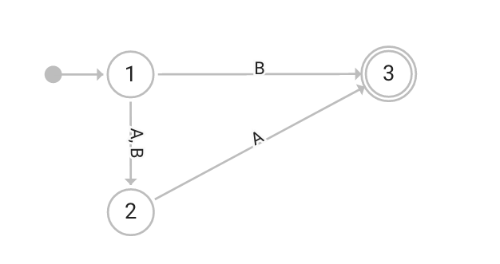
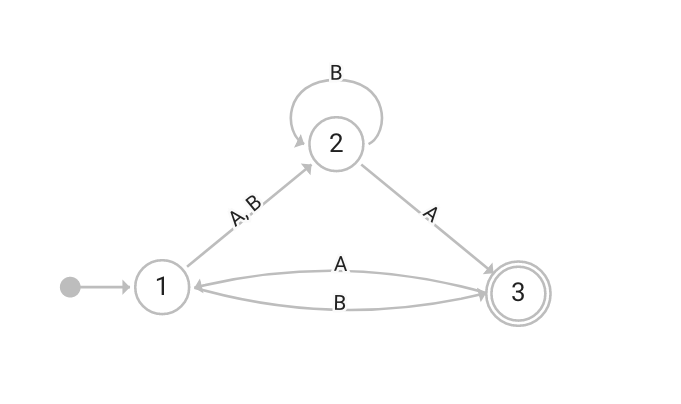
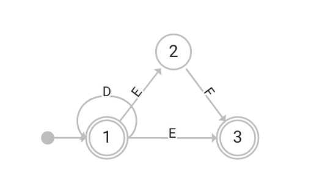
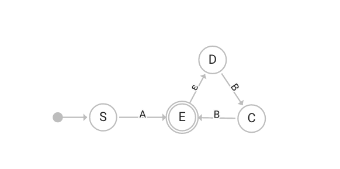

# Automata Editor Test Plan

This document describes test plan for undergoing usability testing for Automata Editor app for iPad.

# Questionnaire

Before the usability test, users will be asked to fill the following questionnaire: https://docs.google.com/forms/d/16YkE5JZvU2bGc1R7KDfI15QZhxEB7MHhzYkodjPQfmY

This questionnaire will be used to assess users' previous experience that can then result in different results when performing test tasks and can help with identifying the underlying design and UX issues the app might have.

# Introduction to the Test

The participants should be instructed to perform tasks described below.
Tasks A-C and D-E will be in a random order where the first group should be first and the participants will not know the tasks in advance. This is to simulate as much as possible how users would interact with the app outside of the testing environment.

Participants will be asked to share their thought process aloud - if they are comfortable with it.

# Tasks to Perform

### Task A:

Create the following automaton:

Simulate following inputs:
- AA
- BA
- B
- AAA
- ABA
- A

Then modify this automaton without clearing the canvas in such a way that it represent this automaton:

And simulate following inputs:
- ABBA
- ABAABA
- AAA
- BAB
- BBB

### Task B:

Create the following automaton:

Simulate following inputs:
- DDE
- DEF
- DE
- EF
- EFE
- DDDDE
- DDDDF

### Task C:

Create the following automaton:

Simulate following inputs:
- A
- BA
- AB
- ABB

### Task D:
Create automaton for the following language:
L = {(10)^n : n ε Ν}

Simulate at least 4 inputs to test whether the automaton is behaving correctly

### Task E:

Create automaton for the following language: 
L = { w : w ε {0,1}* Λ w starts with the string 011}

Simulate at least 4 inputs to test whether the automaton is behaving correctly